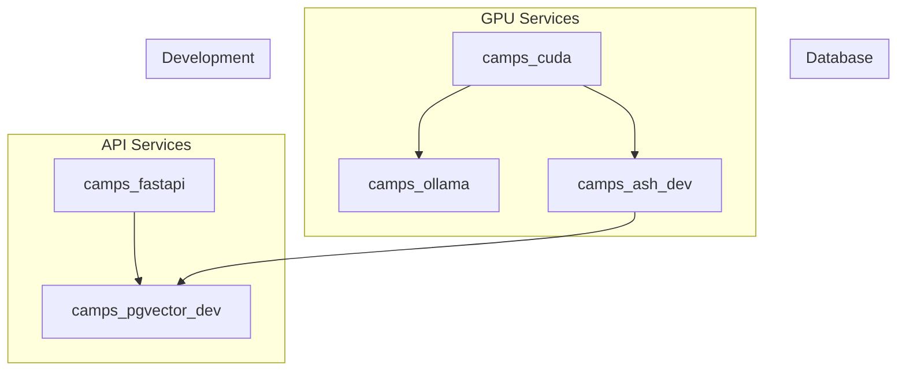

# Project Setup

This project utilizes Docker Compose to orchestrate multiple services for development and production environments. Below is a detailed breakdown of the services and their configurations.


## Table of Contents
- [Project Setup](#project-setup)
  - [Table of Contents](#table-of-contents)
  - [Docker Compose](#docker-compose)
    - [1. camps\_fastapi](#1-camps_fastapi)
  - [Services Overview](#services-overview)
    - [1. camps\_fastapi](#1-camps_fastapi-1)
    - [2. camps\_cuda](#2-camps_cuda)
    - [3. camps\_ollama](#3-camps_ollama)
    - [4. camps\_pgvector\_dev](#4-camps_pgvector_dev)
    - [5. camps\_ash\_dev](#5-camps_ash_dev)
  - [Environment Variables](#environment-variables)
  - [Volumes](#volumes)
  - [Networking](#networking)
  - [Dependencies](#dependencies)
  - [GPU Acceleration](#gpu-acceleration)
  - [SSH Configuration](#ssh-configuration)



    note "Networks:
    - internet: Public network for external communication
    - data: Private network for internal communication"

    note "Dependencies:
    - camps_fastapi depends on camps_pgvector_dev (PostgreSQL)
    - camps_ollama depends on GPU
    - camps_ash_dev depends on camps_pgvector_dev and GPU"

    note "SSH Configuration:
    - SSH keys stored in ./ollama/ollama/
    - Private key: id_ed25519
    - Public key: id_ed25519.pub"

## Docker Compose
### 1. camps_fastapi
- ```docker compose up camps_ollama```
- ```docker compose exec -it camps_ollama bash ```
- ```ollama pull llama3 ```
- ```ollama pull all-minilm ```
- ``` ollama pull qwen2.5-coder:1.5b```
- ```ollama run deepseek-r1:671b```


https://chriskirby.net/run-a-free-ai-coding-assistant-locally-with-vs-code/

## Services Overview

### 1. camps_fastapi
- **Description**: A FastAPI service for handling API requests.
- **Build Context**: Built from the `./fastapi` directory.
- **Command**: Runs `uvicorn app.main:app` with reload enabled.
- **Ports**: Exposes port 8604 (maps to container port 8000).
- **Environment Variables**:
  - `DATABASE_URL`: Connection string for PostgreSQL.
- **Dependencies**: Depends on `camps_pgvector_dev`.
- **Volumes**: Mounts `./fastapi` to `/usr/src/app`.

### 2. camps_cuda
- **Description**: A CUDA-enabled service for GPU computations.
- **Image**: Uses `nvidia/cuda:12.3.1-base-ubuntu20.04`.
- **Command**: Runs `nvidia-smi` to monitor GPU status.
- **GPU Configuration**: Utilizes all available NVIDIA devices.

### 3. camps_ollama
- **Description**: An Ollama service for language model inference.
- **Image**: Uses `ollama/ollama:latest`.
- **Ports**: Exposes port 11434.
- **Environment Variables**:
  - `OLLLAMA_KEEP_ALIVE`: Keeps the service alive for 24 hours.
- **Volumes**: Mounts `./ollama/ollama` to `/root/.ollama`.
- **GPU Configuration**: Requires 1 NVIDIA GPU.

### 4. camps_pgvector_dev
- **Description**: A PostgreSQL service with PGVector extension.
- **Image**: Uses `pgvector/pgvector:pg17`.
- **Ports**: Exposes port 5632 (maps to container port 5432).
- **Environment Variables**:
  - `POSTGRES_DB`: Database name.
  - `POSTGRES_USER`: Database user.
  - `POSTGRES_PASSWORD`: Database password.
- **Volumes**:
  - `./pgvector-init` for initialization scripts.
  - `postgres_data` for persistent storage.

### 5. camps_ash_dev
- **Description**: A development service for GPU-accelerated tasks.
- **Build Context**: Built from `./store` using `gpu.Dockerfile`.
- **Volumes**: Syncs `./camps_ash` to `/app`.
- **GPU Configuration**: Utilizes all available devices.

## Environment Variables

Key environment variables used across services:

- `DATABASE_URL`: PostgreSQL connection string.
- `POSTGRES_DB`, `POSTGRES_USER`, `POSTGRES_PASSWORD`: PostgreSQL credentials.
- `OLLLAMA_KEEP_ALIVE`: Controls Ollama service uptime.
- `NVIDIA_VISIBLE_DEVICES`: Specifies visible GPU devices.

## Volumes

- `postgres_data`: Persistent storage for PostgreSQL data.
- `./pgvector-init`: Directory for database initialization scripts.
- `./fastapi`: Mounts FastAPI application code.
- `./ollama/ollama`: Mounts Ollama configuration and data.

## Networking

- **internet**: Public network for external communication.
- **data**: Private network for internal service communication.

## Dependencies

- `camps_fastapi` depends on `camps_pgvector_dev`.
- `camps_ash_dev` depends on `camps_pgvector_dev`.

## GPU Acceleration

- Services requiring GPU acceleration use NVIDIA devices with specific capabilities:
  - `camps_cuda`: Uses all available devices.
  - `camps_ollama`: Requires 1 GPU.
  - `camps_ash_dev`: Utilizes all available devices.

## SSH Configuration

- SSH keys are stored in `./ollama/ollama/`:
  - Private key: `id_ed25519`
  - Public key: `id_ed25519.pub`
